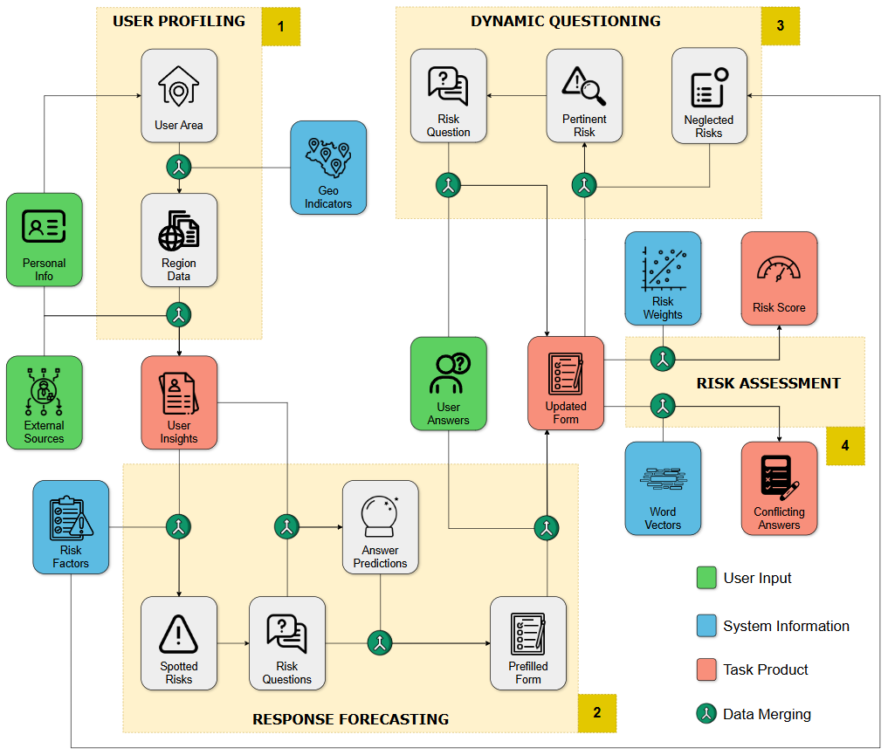

# AI in Insurance: Adaptive Questionnaires for Improved Risk Profiling

**Diogo Silva**  
**June 30, 2025**

## ARQuest (Adaptive Risk Questioning)

This project proposes a solution to personalize insurance questionnaires by adjusting the questions
to the users, aiming at an improved subscription experience and a more precise risk assessment.

To understand how this idea would fit into the underwriting process, a scenario can
be envisioned with a human applicant and a human insurance agent interacting with each other.
Instead of the typical flow, which involves the applicant answering standard questionnaires, the
agent can gather helpful insights beforehand to then ask more suitable questions, simultaneously
avoiding irrelevant topics and analyzing crucial ones. More specifically, the agent would need to
investigate related data sources to have an idea of what promising questions to ask.

### Requirements

It is worth mentioning that the system should be previously equipped with the following components:
- **Geographic indicators:** useful to enrich the overall user context, based on population statis
tics regarding the relevant risks; the data can either be stored from an initial collection phase
or accessed via an API, depending on the source.
- **Risk factors and questions:** a dataset containing the selected risk factors for the insurance
line, along with their respective multiple-choice questions.
- **Risk predictor:** a deterministic or AI algorithm that produces a risk score based on the
values associated with each answer (variable); it can either be part of the framework or
owned by an insurance company, which simply receives the questionnaire record and deals
with the assessment.
- **Word embeddings:** a model with vector representations of words, used to detect major
discrepancies between user answers and high-confidence model predictions.

### Framework

The **ARQuest** framework comprises four primary modules: user profiling, response forecasting, dynamic questioning, and risk assessment, in this exact order.

For the initial **user profiling** task, the person applying for the insurance product is asked to connect with some pre-selected platforms in order to provide external insights, with appropriate consent as expected. These could be government systems, social media applications, or other platforms, depending on the intended purpose. The user should have the freedom to decide which sources to connect among those presented, if any. However, if no sources are included or a crucial one is missing, the system simply redirects the user to the traditional questionnaires, since at least some relevant details are needed to properly conduct the questionnaire dynamically. Additionally, the applicant is required to answer a few common personal information questions, addressing, for example, age, gender, marital status, location, and occupation. The location component is utilized to retrieve the corresponding regional indicators within the system. All this data from the external sources, personal questions, and geographic statistics can be combined to establish a textual representation of the user insights, which will be employed across the next stage.

The **response forecasting** module is designed to identify all the factors that negatively impact risk within the user insights, using the risks dataset as the reference. After spotting these factors, the answers to the respective multiple-choice questions are predicted based on those same insights, therefore creating a pre-filled questionnaire. Both the risk detection and answer prediction tasks are performed by a pre-trained LLM with general knowledge (e.g., GPT model), meaning it is capable of understanding different contexts that could lead to some risks being more present or not. Besides the selected option, the predictions contain the confidence level of the model, and an appropriate explanation, to aid further analysis. Optionally, the user could be presented with the result of this task, including the possibility of manually changing some of the answers that do not align with the user's knowledge.

While the pre-filled questionnaire targets some risk factors, there are others for which no information is present. The user feedback for these neglected aspects can still significantly impact the risk assessment. Therefore, based on the current questions and answers, the LLM is iteratively asked to select the next promising risk to explore (i.e., to ask the applicant) until it reaches a state where the remaining factors will likely be answered positively or have no noticeable effect on the overall risk. This establishes the **dynamic questioning** module. In an ideal scenario, with the user providing a lot of insights, the pre-filled questionnaire could be enough to the point where no further manual answering is demanded.

Finally, with the insurance questionnaire complete, the **risk assessment** task is conducted, using a specific model or algorithm to generate a risk score. Also, the user changes (if any) to the pre-filled answers from the response forecasting process can be analyzed with the help of word embeddings. For each question where the prediction is altered, a similarity score between answers is computed, assuming the prediction is made with enough confidence (above a certain threshold). If the two options (guess and real) being compared are quite opposite, that question is flagged. In a situation where several questions are flagged, a human insurance agent should be assigned to manually deal with the insurance application, as chances are the system did not perform a correct analysis, or the client intentionally misled the risk evaluation.